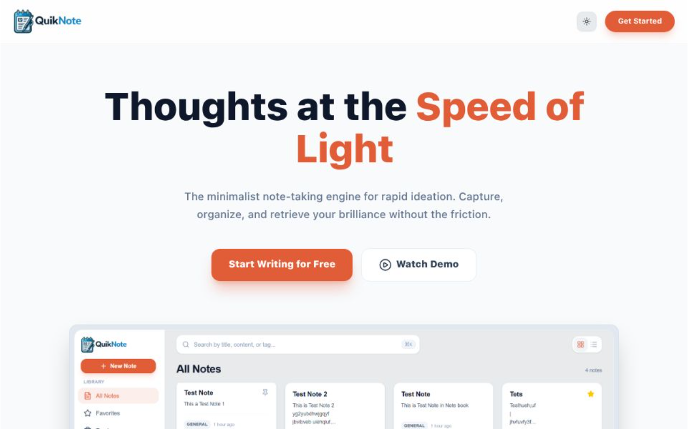

# QuikNote 🚀


> **One-liner pitch:** A modern note-taking app with secure Appwrite authentication, notebook organization, favorites, and intelligent tagging for seamless note management.



---

## 🧐 About The Project

**QuikNote** is a lightweight and intuitive note-taking application designed for users who want quick, organized, and secure note management. It allows users to create, organize, and manage notes across multiple notebooks, tag their notes for easy discovery, and mark favorites for quick access. With dark/light theme support and a clean, responsive interface, QuikNote makes note-taking effortless.

**Key Features:**
* ✅ **Secure Authentication:** Robust user authentication powered by Appwrite
* ✅ **Notebook Organization:** Organize notes into multiple notebooks for better structure
* ✅ **Favorites:** Mark important notes as favorites for quick access
* ✅ **Trash Management:** Safely delete notes with a recoverable trash feature
* ✅ **Theme Support:** Dark and light theme options for comfortable viewing
* ✅ **Profile Management:** Personalized user profiles with account settings
* ✅ **Responsive Design:** Works seamlessly across desktop and mobile devices

---

## 🛠️ Tech Stack

| Layer | Technologies |
| :--- | :--- |
| **Frontend** | React, Vite, JavaScript |
| **Authentication** | Appwrite (Auth Service) |
| **Database** | Appwrite (Cloud Database) |
| **File Storage** | Appwrite Storage |
| **UI & UX** | Tailwind CSS, shadcn/ui, Lucide React icons, Sonner toasts |
| **State Management** | React Context API |
| **Build Tool** | Vite |
| **Tooling** | ESLint, Prettier |

---

## 📚 Engineering Docs

Comprehensive documentation is available in the `/docs` folder:
* **[PRD.md](./docs/PRD.md)** - Product Requirements Document with user stories and features
* **[ARCHITECTURE.md](./docs/ARCHITECTURE.md)** - System architecture, tech stack decisions, and database schema
* **[API.md](./docs/API.md)** - API surface and response formats
* **[DEPLOYMENT.md](./docs/DEPLOYMENT.md)** - Deployment, env vars, and operations guide

**Key Code Entry Points:**
* **Authentication:** `src/appwrite/auth.js` (Auth configuration)
* **Database:** `src/appwrite/db.js` (Database operations)
* **Context Providers:** `src/context/*` (Auth, Notes, Theme, NoteModal)
* **Pages:** `src/pages/*` (Home, Dashboard, Login, Signup, etc.)
* **Components:** `src/components/*` (Navbar, Sidebar, NoteModal, etc.)
* **Utilities:** `src/lib/` (Config, Utils, Helper functions)

---

## ⚡ Quick Start

**1) Clone the repo**
```bash
git clone https://github.com/yourusername/QuikNote.git
cd QuikNote
```

**2) Install dependencies**
```bash
npm install
```

**3) Set up environment variables**
```bash
cp .env.sample .env
# then fill in your Appwrite credentials (Project ID, Endpoint, Database ID, Collection IDs, Storage Bucket ID)
```

**4) Run the development server**
```bash
npm run dev
```
Visit http://localhost:5173

---

## 🤝 Contributing

Contributions are welcome! Please open an issue first to discuss what you'd like to change.
1. Fork the project
2. Create your feature branch: `git checkout -b feature/amazing`
3. Commit your changes: `git commit -m "Add amazing feature"`
4. Push to the branch: `git push origin feature/amazing`
5. Open a Pull Request

---

## 👤 Author

Leonardo Fernandes
- GitHub: [@Leonardo1903](https://github.com/Leonardo1903)
- LinkedIn: [leonardofernandes1903](https://www.linkedin.com/in/leonardofernandes1903/)

---

## 📝 License

This project is licensed under the MIT License. See the LICENSE file for details.
