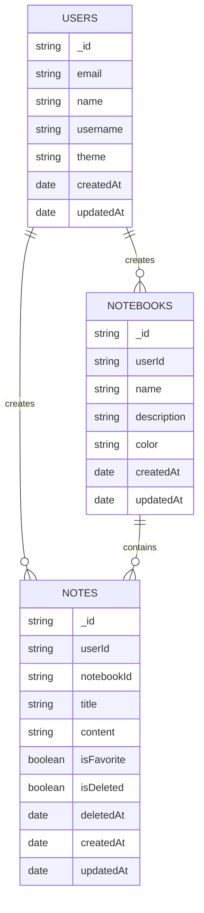

# System Architecture

| Project | **Version** | **Last Updated** |
| :--- | :--- | :--- |
| QuikNote (Note-Taking Application) | 1.0 | January 14, 2026 |

---

## 1. High-Level Design
The system follows a **Client-Side Rendered (CSR) SPA** architecture using React with Vite as the build tool. The frontend communicates with Appwrite backend services for authentication, database operations, and file storage. All user data is secured through Appwrite's authentication and database rules. The application supports offline-friendly UI with real-time sync when connection is available. Key features include dual view modes (grid/list), real-time search functionality, and comprehensive note organization through notebooks.

### System Diagram

```mermaid
graph TD;
    %% Clients
    Client[Web Browser] -->|HTTPS| Vite[React + Vite App];
    
    %% Frontend Routes
    subgraph Frontend_Pages
        Vite -->|Router| Landing[Landing/Home Page];
        Vite -->|Router| AuthPages[Login/Signup Pages with shadcn UI];
        Vite -->|Router| Dashboard[Dashboard with Grid/List Views];
        Vite -->|Router| Notebooks[Notebooks View];
        Vite -->|Router| Favorites[Favorites View];
        Vite -->|Router| Trash[Trash View with Tabs];
        Vite -->|Router| Profile[Profile Page with Settings];
    end
    
    %% Features
    subgraph Frontend_Features
        Dashboard -->|Search| Search[Real-time Search Filter];
        Dashboard -->|Toggle| ViewMode[Grid/List View Toggle];
        AuthPages -->|Uses| Cards[shadcn Card Components];
        Profile -->|Uses| Forms[shadcn Form Components];
    end
    
    %% Appwrite Services
    subgraph Appwrite_Backend
        AuthPages -->|SDK| AppAuth["Appwrite Auth Service"];
        Dashboard -->|SDK| AppDB["Appwrite Database Service"];
        Notebooks -->|SDK| AppDB;
        Favorites -->|SDK| AppDB;
        Trash -->|SDK| AppDB;
        Profile -->|SDK| AppDB;
        Vite -->|SDK| AppStorage["Appwrite Storage Service"];
    end
    
    %% Data Layer
    subgraph Data_Layer
        AppAuth -->|Manage| Users["Users Collection"];
        AppDB -->|Manage| Notes["Notes Collection"];
        AppDB -->|Manage| Notebooks["Notebooks Collection"];
        AppStorage -->|Manage| Files["File Storage"];
    end
    
    %% Context & State
    subgraph State_Management
        Vite -->|Context| AuthContext["Auth Context"];
        Vite -->|Context| NotesContext["Notes Context"];
        Vite -->|Context| ThemeContext["Theme Context"];
        Vite -->|Context| ModalContext["Modal Context"];
    end
```


---

## 2. Tech Stack

| Layer | Technology | Reason for Choice |
| :--- | :--- | :--- |
| **Frontend Framework** | React 18 | Modern component-based UI, hooks for state management, large ecosystem. |
| **Build Tool** | Vite | Fast development server, optimized builds, excellent HMR (Hot Module Replacement). |
| **Language** | JavaScript | Fast development cycle; TypeScript optional for future enhancement. |
| **UI Library** | shadcn/ui + Tailwind CSS | Pre-built accessible components (14+ components), fully customizable, no runtime overhead. Consistent design system across all pages including Login, Signup, Profile, and Dashboard components. |
| **State Management** | React Context API | Sufficient for app size; no need for Redux; lightweight solution. |
| **Routing** | React Router v6 | Client-side routing, dynamic route matching, nested routes support. |
| **Authentication** | Appwrite Auth | Secure user authentication with email/password, sessions, and permissions. |
| **Database** | Appwrite Cloud Database | Document-oriented, flexible schema, real-time updates, built-in security rules. |
| **File Storage** | Appwrite Storage | Secure file uploads and management with access control. |
| **Validation** | Browser validation + JS checks | Client-side form validation; Appwrite rules provide server-side validation. |
| **Icons** | Lucide React | Lightweight, tree-shakeable, 1000+ icons. |
| **Notifications** | Sonner | Lightweight toast library for user feedback. |
| **HTTP Client** | Fetch API / Appwrite SDK | Appwrite SDK handles authentication and data operations seamlessly. |
| **Deployment** | Vercel / Netlify | Zero-config deployment for React SPA; global CDN for fast delivery. |

---

## 3. Database Schema

We use a document-oriented schema optimized for per-user data retrieval and efficient querying.



### Key Indexes
For optimal query performance, the following indexes are applied in Appwrite:

- **`notes.userId, isDeleted=false, createdAt DESC`** - Fast dashboard note listing ordered by recency
- **`notes.userId, isFavorite=true`** - Quick queries for favorite notes
- **`notes.notebookId`** - Fast queries for notes within a notebook
- **`notebooks.userId`** - User's notebooks retrieval

---

## 4. Key Technical Decisions

### Why React + Vite instead of Next.js?
React with Vite is chosen for:
- **Lightweight:** No server-side rendering overhead for a client-side app
- **Fast Development:** Vite's instant HMR and faster builds improve developer experience
- **Flexibility:** Easy to add Appwrite without server-side routes
- **SPA Benefits:** Full client-side control for note management and offline-friendly features

### Why Appwrite instead of Firebase?
Appwrite provides:
- **Self-hosted Option:** Can be self-hosted or cloud; full data privacy control
- **Open Source:** Community-driven; transparency and customization
- **Built-in Database:** Integrated database with fine-grained permissions per collection
- **Storage:** File storage with access control rules
- **Email Services:** Optional email support for future notifications

### Why Context API instead of Redux?
Context API is chosen for:
- **Simpler State:** App doesn't require complex state transitions
- **Less Boilerplate:** Ideal for auth, theme, modal, and notes state
- **Bundle Size:** No additional dependencies; lighter bundle
- **Future Migration:** Easy to upgrade to Zustand or Redux if needed

### Authentication Flow
1. User signs up/logs in via Appwrite Auth service
2. Appwrite creates a session and stores it in browser storage
3. React Context stores authentication state
4. All subsequent API calls include session credentials automatically via Appwrite SDK
5. Protected routes check auth context; redirect to login if not authenticated
6. Session persists across page reloads

### View and Search Features
1. **Dual View Modes:** Users can toggle between Grid (masonry layout) and List views
2. **Real-Time Search:** Search functionality filters notes by title, content, and tags
3. **View Persistence:** Current view preference maintained within session
4. **Cross-Page Search:** Search works consistently across Dashboard, Favorites, Notebooks, and Trash
5. **Dynamic Count:** Note count in header updates based on search results

### Note Organization with Notebooks
1. User creates multiple notebooks for different projects/categories
2. Notes are associated with a `notebookId` in the database
3. Dashboard shows all notes; sidebar filters by notebook
4. Moving notes between notebooks updates the `notebookId` field
5. Deleting a notebook prompts user to reassign or delete notes

### Trash & Soft Delete
1. Deleting a note sets `isDeleted: true` and stores `deletedAt` timestamp
2. Trash view queries only `isDeleted: true` notes
3. Restoring a note sets `isDeleted: false`
4. Permanently deleting removes the document from database
5. Optional: Auto-purge deleted notes after 30 days

---

## 5. Project Directory Structure

Organization of React + Vite project:

```
/root
  ├── /public                  # Static assets (logo, favicon, icons)
  ├── /src
  │     ├── /components        # Reusable React components
  │     │     ├── /ui                   # shadcn/ui components
  │     │     ├── Navbar.jsx            # Top navigation bar
  │     │     ├── Sidebar.jsx           # Left sidebar navigation
  │     │     ├── Header.jsx            # Page header with search and view toggle
  │     │     ├── Footer.jsx            # Page footer
  │     │     ├── NoteModal.jsx         # Create/edit note modal
  │     │     ├── ConfirmDialog.jsx     # Confirmation dialog
  │     │     ├── MainGrid.jsx          # Notes grid/list view with dual layout support
  │     │     ├── ThemeToggle.jsx       # Dark/light theme toggle
  │     │     ├── Benefits.jsx          # Landing page benefits
  │     │     ├── Features.jsx          # Landing page features
  │     │     ├── Hero.jsx              # Landing page hero
  │     │     ├── CTA.jsx               # Call-to-action section
  │     │     └── index.js              # Component exports
  │     ├── /context           # React Context providers
  │     │     ├── authContext.jsx       # Authentication state
  │     │     ├── notesContext.jsx      # Notes state and operations
  │     │     ├── noteModalContext.jsx  # Note creation/edit modal state
  │     │     └── themeContext.jsx      # Dark/light theme state
  │     ├── /pages             # Page components for routing
  │     │     ├── Home.jsx              # Landing page
  │     │     ├── Dashboard.jsx         # Main dashboard with all notes
  │     │     ├── Notebook.jsx          # View notes in a notebook
  │     │     ├── Favorites.jsx         # Favorite notes view
  │     │     ├── Trash.jsx             # Deleted notes view
  │     │     ├── Login.jsx             # Login page
  │     │     ├── Signup.jsx            # Sign up page
  │     │     ├── Profile.jsx           # User profile page
  │     │     └── index.js              # Page exports
  │     ├── /appwrite          # Appwrite service configuration
  │     │     ├── auth.js               # Authentication service
  │     │     └── db.js                 # Database operations service
  │     ├── /lib               # Utility functions
  │     │     ├── config.js             # Appwrite config and constants
  │     │     └── utils.js              # Helper functions (cn, formatters)
  │     ├── App.css            # Global app styles
  │     ├── App.jsx            # Root App component with providers
  │     ├── index.css          # Global CSS and Tailwind imports
  │     └── main.jsx           # Entry point
  ├── /docs                    # Documentation
  │     ├── PRD.md
  │     ├── ARCHITECTURE.md    # You are here
  │     ├── API.md
  │     └── DEPLOYMENT.md
  ├── .env.sample              # Environment variable template
  ├── .env.local               # Local environment (not committed)
  ├── vite.config.js           # Vite configuration
  ├── jsconfig.json            # JavaScript configuration
  ├── eslint.config.js         # ESLint rules
  ├── components.json          # shadcn/ui config
  ├── tailwind.config.js       # Tailwind CSS config
  ├── package.json             # Dependencies and scripts
  ├── index.html               # HTML entry point
  └── README.md                # Project overview
```

---

## 6. API Design Principles

### Appwrite SDK Integration
Instead of REST endpoints, we use Appwrite JavaScript SDK for:
- **Authentication:** `account.create()`, `account.createSession()`, `account.logout()`
- **Database:** `databases.listDocuments()`, `databases.createDocument()`, `databases.updateDocument()`, `databases.deleteDocument()`
- **Storage:** `storage.createFile()`, `storage.deleteFile()`

### Query Patterns
Database queries are built using Appwrite Query language:
```javascript
// Get all notes for current user
const notes = await databases.listDocuments(
  databaseId,
  notesCollectionId,
  [Query.equal('userId', userId), Query.equal('isDeleted', false)]
);

// Get favorite notes
const favorites = await databases.listDocuments(
  databaseId,
  notesCollectionId,
  [Query.equal('userId', userId), Query.equal('isFavorite', true)]
);
```

### Error Handling
Consistent error handling across services:
```javascript
try {
  const note = await databases.createDocument(...);
  showSuccessToast('Note created successfully');
} catch (error) {
  if (error.code === 401) {
    showErrorToast('Authentication required');
  } else {
    showErrorToast('Failed to create note');
  }
}
```

### Async Operations
All database operations are async and use async/await:
```javascript
async function fetchNotes() {
  try {
    const response = await databases.listDocuments(...);
    return response.documents;
  } catch (error) {
    console.error('Failed to fetch notes', error);
    throw error;
  }
}
```

---

## 7. Security Measures

### Authentication & Authorization
- **Appwrite Auth:** User authentication with email/password
- **Session Management:** Appwrite sessions stored in browser (secure by default)
- **Protected Routes:** React Router private routes check authentication context
- **Database Permissions:** Appwrite collection rules enforce user isolation (users can only access their own notes)
- **Storage Permissions:** File access limited to authenticated users

### Input Validation
- **Client-Side Validation:** Form validation before submission
- **Server-Side Rules:** Appwrite database rules enforce data constraints
- **Type Checking:** JavaScript runtime validation for API responses

### Password Security
- **Appwrite Handling:** Passwords never transmitted to frontend; Appwrite handles hashing
- **HTTPS Only:** All communication over HTTPS

### User Isolation
- **UserId Filtering:** Every query includes `userId` filter to prevent cross-user access
- **Database Rules:** Appwrite permissions prevent unauthorized document access
- **Collection Permissions:** Write/Read rules restrict access to document creator only

### Environment Variables
Secrets stored in `.env.local` (never committed):
```
VITE_APPWRITE_PROJECT_ID      # Appwrite project ID
VITE_APPWRITE_ENDPOINT         # Appwrite server endpoint
VITE_APPWRITE_DATABASE_ID      # Database ID
VITE_APPWRITE_NOTES_COLLECTION_ID       # Notes collection
VITE_APPWRITE_NOTEBOOKS_COLLECTION_ID   # Notebooks collection
VITE_APPWRITE_STORAGE_BUCKET_ID         # Storage bucket
```

### No SQL Injection
- **Appwrite Queries:** SDK queries are parameterized; no raw query strings
- **Input Sanitization:** Validated before database operations

---

## 8. Performance Optimizations

### Code Splitting
- **Route-Based Splitting:** React Router lazy-loads pages automatically
- **Dynamic Imports:** Heavy components lazy-loaded with `React.lazy()`
- **Component Splitting:** UI components separated for faster rendering

### Caching Strategy
- **LocalStorage:** User theme preference cached locally
- **Browser Cache:** Static assets (JS, CSS) cached with Vite hashing
- **Appwrite Caching:** SDK caches auth state to reduce API calls
- **Component Memoization:** `React.memo()` for expensive components

### Database Query Optimization
- **Proper Indexing:** Indexes defined in Appwrite for common queries
- **Limit Results:** Dashboard paginated to avoid loading all notes at once
- **Specific Fields:** Query only needed fields to reduce payload size

### Bundle Size Optimization
- **Tree Shaking:** Vite automatically removes unused code
- **Component Lazy Loading:** Pages loaded on-demand via React Router
- **CSS Optimization:** Tailwind purges unused styles in production

### UI Performance
- **Virtualization:** For large note lists, consider virtual scrolling (future)
- **Debouncing:** Search input debounced to reduce query frequency
- **Optimistic Updates:** UI updates immediately; syncs with backend

---

## 9. Deployment Architecture

### Hosting Options
- **Frontend:** Vercel, Netlify, or GitHub Pages (static hosting)
- **Appwrite Backend:** Cloud (appwrite.cloud) or self-hosted
- **File Storage:** Appwrite Storage (built-in)

### CI/CD Pipeline
1. **Push to `main`** triggers Vercel/Netlify build
2. **Build Steps:**
   - Install dependencies (`npm install`)
   - Run linter (`npm run lint`)
   - Build with Vite (`npm run build`)
3. **Deploy to Production:** Automatic deployment to live domain

### Environment Promotion
- **Development:** Local (`localhost:5173`)
- **Preview:** Vercel preview deployments (per-PR URLs)
- **Production:** `main` branch auto-deploys to live domain

### Build Optimization
```bash
npm run build    # Optimized production build
npm run preview  # Local preview of build
```

---

## 10. Monitoring & Observability
*(Planned for future implementation)*

- **Error Tracking:** Sentry for frontend errors and exceptions
- **Performance Monitoring:** Web Vitals tracking (Lighthouse, Web Analytics)
- **User Analytics:** PostHog or Mixpanel for feature usage
- **Appwrite Monitoring:** Cloud dashboard for database and storage metrics
- **Logging:** Console logs with structured error messages

---

## Appendix: Related Documents
- [PRD.md](./PRD.md) - Product requirements and user stories
- [API.md](./API.md) - API endpoint documentation
- [DEPLOYMENT.md](./DEPLOYMENT.md) - Setup and deployment guide
- [README.md](../README.md) - Project overview and quick start
